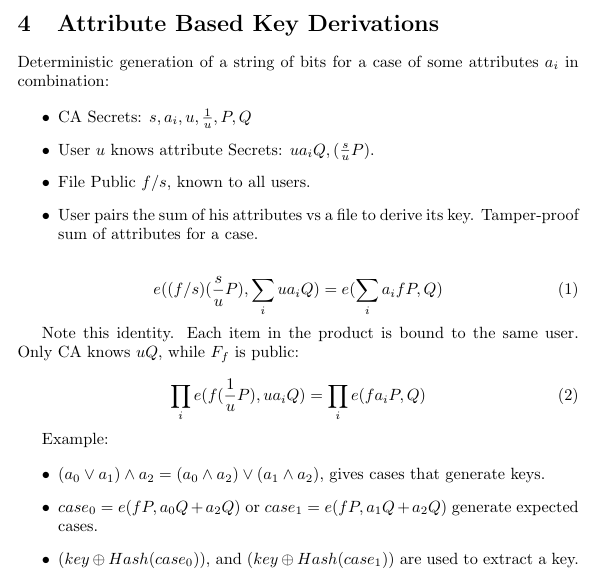

EC Pairings over bn256
==================

This is an attempt to solve the core problem of attribute based encryption, where the goal is to be able to use CA-issued attributes to AND together properties to pass a threshold and generate an AES key.

For example, imagine that we have a complete language for and and or combinations....

```
cat resume.pdf | go run cpabe.go '(and age:adult (or citizen:US citizen:NL))'
```

We can easily transform this into two cases that can possibly match

- (and age:adult citizen:US)
- (and age:adult citizen:NL)

If we have a target AES key `k` that we want to encrypt, then we can store the key xored with a case for attributes AND together.

It is a central problem in AttributeBasedCryptography to ensure that the attributes all come from the SAME user.  That way, an adult from UK cannot colude with a non-adult citizen of US to produce a key.  This means that we have to defend against legitimate users abusing intermediate steps of computation to elevate their access.


